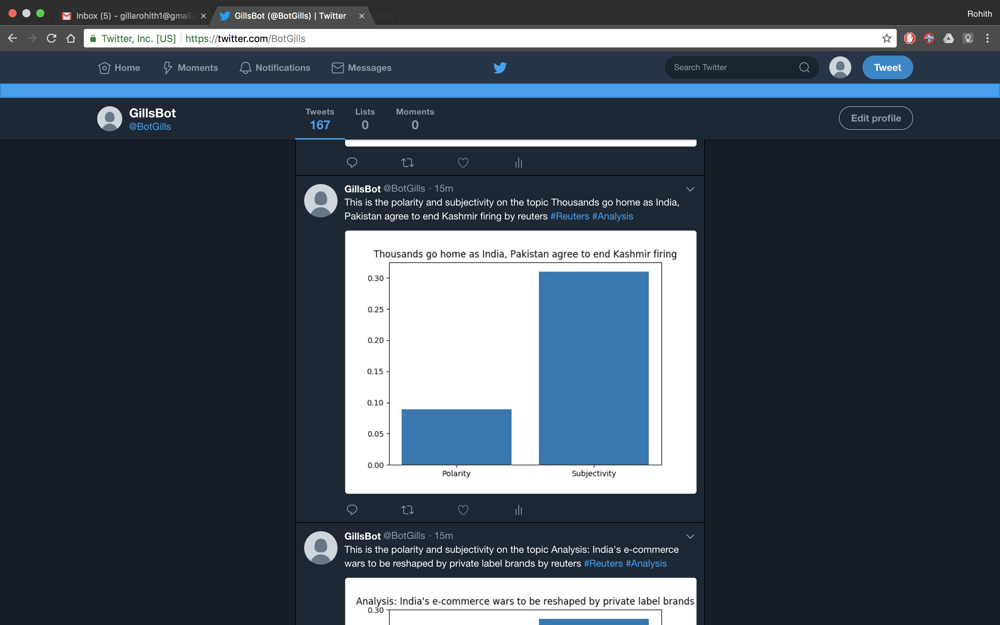

# TwitterNewsAnalyserBot


[](https://forthebadge.com) [](https://forthebadge.com)

## Introduction:
One of the most important things a person does on a daily basis is follow news. What is this concept of news and the nature of it? We all know that the above question is pretty self explanatory. So, what if the “news” that one gets to know is a modified version of truth?
A lot of us do follow one or a couple of specific news channels and subscribe to a specific news paper. And in the process, we often miss out on how that information is being processed and released as news by the other media entities on the same topic. So the purpose of this is to bring into light, the differences and the extent upto which each media organisation is influencing/filtering what is reaching the reader, based on their own reasons and convenience so that, people are less likely to be deceived.

## Brief on project:
Creation of a Twitter Bot which analyses and compares the similar kind of news and plots the polarity and subjectivity of the news channel on trending topic.
A sample plot is shown at the end of the file.
So the next update or task would be adding new news channels and comparing their similar news.


## Work Flow:
1) Web Scraping the data from other news channels
2) Comparison model to compare the similar kind of headings from different news channels
3) Working with Twitter Bot
4) Hosting it


Here's an image of bot in action:


## Pre-requisites 

1. Twitter Account
    
2. Modules required
    * tweepy
    * time
    * re
    * datetime
    * bs4
    * textblob
    * matplotlib
     
### Installation

```bash
pip install requirements.txt  
```

### Creating twitter api credentials

1. Go to the following [link](https://apps.twitter.com/ "Twitter App").
2. Click the create app button
2. Fill the necessary details like :
    * Name of the bot.
    * Website name.
    * Description.
3. Goto Keys and tokens and generate your access tokens.

** But twitter updated their policy and so some changes need to be done **

### Using the tweepy api

Authorise the app with tweepy api with consumer keys and access tokens.
Now replace the credentials in the code with your credentials and search hashtags with
the one which you wanted and enjoy the app up and running.


### Hosting in heroku

Use the following commands to host this app in heroku
```bash
heroku create
git add .
git commit -m "initial commit"
git push heroku master
heroku ps:scale worker=1
heroku logs --tail
```
[](http://hits.dwyl.io/RohithGilla12/TwitterNewsAnalyserBot)
